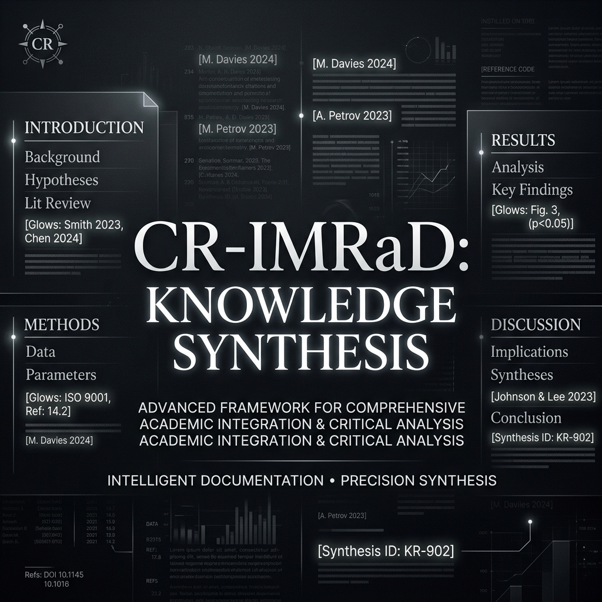

  
  
  <h1>CR-IMRaD</h1>
  
<b>A Unified Standard for High-Fidelity Knowledge Synthesis</b>

  

    
    
    
  

---

### 💎 GEMS Notice
This repository is the new home for all **GEMS** research. Traditional GEMS content has been migrated to:
[➡️ https://okayestperson.neocities.org/OkayestPerson/WEBSITE/GeminiGems](https://okayestperson.neocities.org/OkayestPerson/WEBSITE/GeminiGems)

---

### 📄 Scientific Summary
**CR-IMRaD** (Cognitive-Resonant IMRaD) is a writing standard designed to convert dense technical knowledge into high-fidelity documents that are universally readable without sacrificing scientific precision.

The standard optimizes for **low-friction cognitive processing** by enforcing strict rules on metaphor-first explanations, skimmable distillation paths (bolded words), and context-aware citations. It bridges the gap between raw research and accessible implementation.

**Key Principles:**
1. **Fidelity > Comfort** — Never simplify the truth; simplify the *friction*.
2. **Spiral Ever Upwards** — Layers of complexity must be accessible sequentially.
3. **Chiral Symmetricality** — Balance internal coherence with external citations.

---

### 📋 Technical Inventory

| Filename | Description |
| :--- | :--- |
| 📄 **`cr_imrad.pdf`** | The complete master specification document. |
| ⚙️ `cr_imrad.json` | Machine-readable configuration and validator spec. |

---

### 📚 Citation
If you use this standard in your research, please cite:
- **Specification:** Haskin, J. K. (2026). *CR-IMRaD*. [doi:10.17605/OSF.IO/RY59S](https://doi.org/10.17605/OSF.IO/RY59S)
- **Automation Spec:** Haskin, J. K. (2026). *CR-IMRaD 3.1 Automation Json*. [doi:10.17605/OSF.IO/XKH9V](https://doi.org/10.17605/OSF.IO/XKH9V)

---

### 🔗 DodecaGone Ecosystem
- **Official Hub:** [DodecaGone Systems](https://github.com/DodecaGoneSystems)
- **Math Engine:** [Forge Math](https://github.com/DodecaGoneSystems/ForgeMath)
- **Stabilization:** [You Are Here](https://github.com/DodecaGoneSystems/You-Are-Here)

  <code>><^</code> 
  <i>GNU Terry Pratchett</i>

